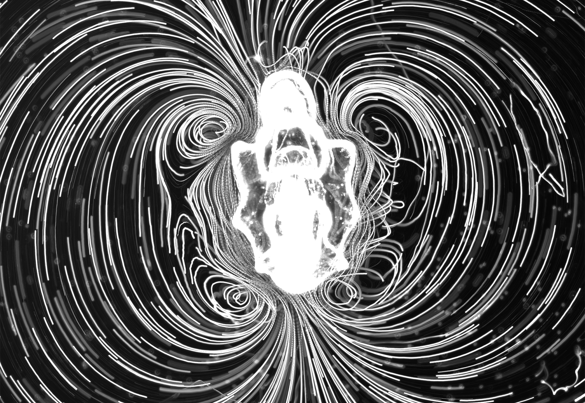

# flowtrace for Python

# Flowtrace for Python

Implementation of the flowtrace tool as a module for Python 2 / Python 3

	

Examples of this code applied to videos can be found [here](http://www.wgilpin.com/flowtrace_docs/gallery.html). If you find this repository useful, please consider citing the accompanying paper:

> William Gilpin, Vivek Prakash, Manu Prakash. "Flowtrace: simple visualization of coherent structures in biological fluid flows." J Exp Biol. 2017

## Installation

Use your browser to download flowtrace for Python from [this repository](https://github.com/williamgilpin/flowtrace_python) (Direct download link [here](https://github.com/williamgilpin/flowtrace_python/archive/master.zip)). On OSX/Linux, you can initiate the download from the terminal using

	$ curl -OS https://github.com/williamgilpin/flowtrace_python/archive/master.zip

Or, using git

	$ git clone https://github.com/williamgilpin/flowtrace_python.git

## Running flowtrace

Somewhere in your script, include the import statement

	$ from flowtrace import flowtrace

Run using all defaults and a 30 frame projection window

	$ flowtrace('sample_data',30,'sample_output/')

Subtract the median of every 30 frames to remove slow-moving background objects

	$ flowtrace('sample_data',30,'sample_output/',subtract_median=True)

Color the output streamlines to denote the direction of time

	$ flowtrace('sample_data',30,'sample_output/',color_series=True)

Adjust the number of cores that the code uses to multithread

	$ flowtrace('sample_data',30,'sample_output/',max_cores=2)

## API and Options

### Arguments

**imagedir : str**
+ path to directory containing raw image files
        
**frames_to_merge : int**
+ The numbe of frames to merge to form a single streamline image
    
**out_dir : str**
+ path to directory where streamline files are saved
        
**max_cores : int**
+ With multi-threading enabled, the maximum number of simultaneous jobs to run. 
+ When running this, it's useful to calculate the total RAM available versus that required to completely hold an image stack of length frames_to_merge, since parallelization is not useful if there's not enough RAM for each core to complete a task

**frames_to_skip : int**
+ The number of images to skip when building each substack

### Keywords

**invert_color : bool**
+ Set to "True" for dark objects moving against a white background

**take_diff : bool**
+ Whether to take the difference of consecutive frames
    
**diff_order : int**
+ The order of the difference in frames when take_diff is used

**subtract_median : bool**
+ For each substack, subtract the median before taking the z projection

**subtract_first : bool**
+ For each substack, subtract the first frame before taking the z projection

**add_first_frame : bool**
+ Add the unaltered first frame of the stack back to the stack before taking z projection. Makes it possible to view sharp structures in median transformed data

**color_series : bool**
+ Color the time traces

## Debugging

**The code just won't run**
+ If you are consistently getting errors on your system, try disabling parallization with the setting `use_parallel=False`. Multithreading in Python can be configuration-specific, and so flowtrace will not succeed in multithreading if Python's multiprocessing library is not working.

	$ flowtrace('sample_data',30,'sample_output/', use_parallel=False)

+ Certain combinations of keyword arguments might cause errors--for example, using median subtraction and inverting the color simultaneously might yield unpredictable results on color images.

**The code is performing surprisingly slowly**. 
+ If the code seems to be reading very slowly, try using Fiji or ImageJ to open the image sequence as a stack, convert to 8-bit tif (or RGB if using color) and then re-save all the files Even if the raw data is supposedly .tif, sometimes the encoding is funny and so scipy struggles to read the files.

**Attempts to read or write files fail to find the appropriate directory** (Windows only)
+ Make sure you are using the correct format for filepaths on Windows. Instead of `Users/John/pics` use `Users//John//pics` or `Users\John\pics`

## Future

Bug reports and pull requests are encouraged [through GitHub](https://github.com/williamgilpin/flowtrace_python)

